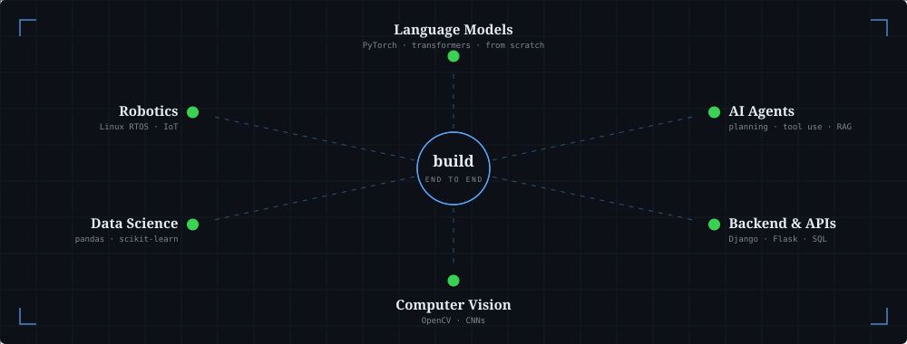

<picture>
  <source media="(prefers-color-scheme: dark)" srcset="./banner-dark.svg">
  <source media="(prefers-color-scheme: light)" srcset="./banner-light.svg">
  
</picture>

AI engineer in Coimbatore, India. I build across the whole stack — language models and agentic
systems, the backends and APIs that serve them, computer vision, data science, and the
occasional robot. I try to understand a problem and its domain properly before I start building.

---

<picture>
  <source media="(prefers-color-scheme: dark)" srcset="./capabilities-dark.svg">
  <source media="(prefers-color-scheme: light)" srcset="./capabilities-light.svg">
  
</picture>

---

### What I build

**AI agents** — this is where most of my work lives. Systems that classify intent, pick tools,
call them, and reason over the results in structured steps rather than one-shot prompting:
a factory copilot for inventory and risk reporting, a healthcare assistant built behind
guardrails, an industrial data agent with sandboxed code execution, and a Mixture-of-Experts
platform that routes queries to specialised experts over shared memory. Roughly a dozen of my
repos are agents of one kind or another.

**Language models** — I don't stop at calling an API. I've fine-tuned small models on private
data and written a **27.8M-parameter GPT from scratch** in PyTorch — attention, tokenizer and
training loop by hand — to understand what's actually happening inside one.

**Backends & full stack** — Django and Flask services, REST APIs, SQL and MongoDB, deployed and
running. Most of my AI work ships behind an endpoint someone can actually call.

**Computer vision** — CNN classifiers for medical imaging and real-time detection, built with
OpenCV and TensorFlow.

**Data science** — cleaning messy real-world data, training models, and putting them behind
interfaces non-technical people can use.

**Robotics** — motion profiling under real-time constraints on Linux RTOS, with IoT control.

### Recognition

- **Winner**, Best Use of AI for Zero Hunger & Economic Growth — Tech for Good: Build with AI, GDG Coimbatore (2026)
- **Top 5 of 70+ teams** — GenAI Hackathon, ML.CBE (2025)
- **1st place**, paper presentation — RVS College of Engineering & Technology, AI in healthcare (2025)
- **1st place**, paper presentation — P.A. College of Engineering & Technology, ML & medical algorithms (2024)
- **1st place**, Idethon at Varnam — Karpagam College of Engineering & Technology (2025)

### Running right now

**[THE VISSION](https://jayaragul.github.io/THE_VISSION/)** — a daily newspaper about AI with no
newsroom. A scheduled pipeline researches the day's stories, writes them, checks every claim
against its own sourcing rules, and publishes. The interesting part is what it does when it
fails: an edition that can't clear the editorial gate doesn't ship, and yesterday's paper stays
up. It has never invented a source, because it isn't allowed to run one it couldn't open.

Three tiers degrade independently, so the site cannot go dark — the AI-written Edition, a
Digest ranked by a deterministic program with no model in the loop, and the raw Wire straight
from publishers' feeds. Link rot is checked weekly across every source ever cited, storage is
projected years ahead against the hosting ceiling, and corrections are permanent and public.

[`the repo`](https://github.com/Jayaragul/THE_VISSION) · Node, zero dependencies · Gemini CLI on
GitHub Actions · the model behind it is deliberately swappable

---

### Selected work

Five, on purpose — not a repo index. Each one exists to prove a different fundamental rather
than to add to a count.

| | |
|---|---|
| **[slm-from-scratch](https://github.com/Jayaragul/slm-from-scratch)** | A 27,846,000-parameter decoder-only transformer trained on TinyStories — causal attention, weight-tied embeddings and the training loop, all hand-written, because calling an API doesn't tell you what's actually happening inside one. Trained weights included. |
| **[The-solver](https://github.com/Jayaragul/The-solver)** | SANKHYA — a mathematical-optimisation core built so nothing it reports is taken on trust: revised simplex with an independently checked primal-dual certificate, sparse LU with threshold pivoting, exact-simplex MILP branch-and-bound with validated cover cuts, CUDA PDHG for LP and convex QP. Native C/CUDA production path, no Python required to run it. |
| **[twinops](https://github.com/Jayaragul/twinops)** | Draw your factory, press play, watch the bottleneck appear. A zero-install discrete-event simulator for production lines, running entirely in the browser — the hard part was measuring blocked/starved time as first-class state, not the animation. |
| **visionrag** | Point a phone at a room; come back later and it says what changed. Place recognition with no GPS or markers, object persistence estimated from detections *and* misses, and an honest line between checked-and-absent and never-looked. Runs on a laptop CPU — no GPU, no cloud. Private repo. |
| **[agri-hackathon](https://github.com/Jayaragul/agri-hackathon)** | **Thulir** — a voice-first farming companion for smallholder farmers, in Tamil or English. Every crop ranking and dosage comes from a deterministic engine; the model only explains it or reads a photo. Winner, Best Use of AI for Zero Hunger & Economic Growth, GDG Tech for Good 2026. |

The rest — agent wrappers, dashboards, one-off tools — are on [GitHub](https://github.com/Jayaragul?tab=repositories)
and the [portfolio](https://jayaragul.github.io/MY-PORTFOLIO-WEBSITE/) if you want the full list.

**Community projects** — built for other people to use, not for me:

| | |
|---|---|
| **[INFERENCING-LLM-LAMA](https://github.com/Jayaragul/INFERENCING-LLM-LAMA)** | A privacy-first local AI platform — agentic capabilities (web search, RAG, tools) running fully offline on Ollama + FastAPI, so nothing anyone asks it leaves their machine. |
| **certibatch** | Bulk certificate generator for event and workshop organisers — upload one template image and a spreadsheet of names, position the fields once, and it renders a personalised PDF per participant, bundled into a zip. Private repo. |

---

### What shipping these actually taught me

**Don't try to make the model perfect — close the loop.** THE VISSION publishes unattended.
Every time I hardened the prompt against one failure, the model found a different rule to break
the next morning: a duplicate source one day, a confidence label without a primary the next.
Prompts don't converge. `generate → validate → repair → revalidate` does, and the validator's
own error text turns out to be a near-perfect repair instruction.

**A checker that contradicts your own rules will deadlock you.** The paper's rules say a short
edition beats a padded one. Its validator warned on exactly that, and the gate treated warnings
as fatal across the whole archive — so one thin Tuesday in August blocked every future edition
permanently. Advisory and blocking are different things and the distinction has to live in code.

**Instrument the failures that never announce themselves.** Roughly half of cited links rot
within a decade, oldest first, where nobody looks. Storage ceilings arrive without warning. Both
are now measured on a schedule, so they surface as a scheduled decision rather than an outage.
The first link check found two dead citations — one of them three hours old.

---

### How my agents actually work

<picture>
  <source media="(prefers-color-scheme: dark)" srcset="./pipeline-dark.svg">
  <source media="(prefers-color-scheme: light)" srcset="./pipeline-light.svg">
  
</picture>

A query gets classified by intent, routed to the expert best suited to it, answered with tools
where needed, and merged back into shared memory so the next turn has context. Not one-shot
prompting.

---

### Writing

<!-- MEDIUM:START -->
- [How an LLM Becomes an AI Agent: The 5 Engineering Layers Behind Agentic AI](https://medium.com/@jayaragul/how-an-llm-becomes-an-ai-agent-49ba4a2e8e06) &nbsp;29 Aug 2026
- [Why Agentic AI Is the Next Big Shift in Artificial Intelligence](https://medium.com/@jayaragul/why-agentic-ai-is-the-next-big-shift-in-artificial-intelligence-ead0b98adabe) &nbsp;23 May 2026
- [From ‘Attention Is All You Need’ to My Own GPT: Training an SLM From Scratch](https://medium.com/@jayaragul/from-attention-is-all-you-need-to-my-own-gpt-training-an-slm-from-scratch-b426ab9ec604) &nbsp;31 Dec 2025
- [“Two Days, One Summit, Infinite Lessons: Our Start-up's Takeaways from TNGSS 2025”](https://medium.com/@jayaragul/two-days-one-summit-infinite-lessons-our-start-ups-takeaways-from-tngss-2025-983757508696) &nbsp;12 Oct 2025
<!-- MEDIUM:END -->

### Working with

`Python` · `PyTorch` · `SQL` · `Django` · `FastAPI` · `Flask` · `OpenCV` · `TensorFlow` · `pandas` · `scikit-learn` · `MongoDB` · `LLMs & fine-tuning` · `Agentic AI` · `RAG` · `Node` · `TypeScript` · `React` · `Google Cloud` · `GitHub Actions` · `Linux RTOS` · `Git`

---

<picture>
  <source media="(prefers-color-scheme: dark)" srcset="https://raw.githubusercontent.com/Jayaragul/Jayaragul/output/snake-dark.svg">
  <source media="(prefers-color-scheme: light)" srcset="https://raw.githubusercontent.com/Jayaragul/Jayaragul/output/snake-light.svg">
  
</picture>

---

[Portfolio](https://jayaragul.github.io/MY-PORTFOLIO-WEBSITE/) · [Medium](https://medium.com/@jayaragul) · jayaragul.in@gmail.com
