AI engineer in Coimbatore, India. I work on language models, agentic systems and the
backends that carry them — and I try to understand a problem and its domain properly
before I start building.

Most recently that meant not settling for calling an LLM API. I wrote one instead:
a **27.8M-parameter GPT trained from scratch** in PyTorch — attention, tokenizer pipeline
and training loop by hand, no `transformers`, no `nanoGPT` fork.

---

### Selected work

| | |
|---|---|
| **[slm-from-scratch](https://github.com/Jayaragul/slm-from-scratch)** | A 27,846,000-parameter decoder-only transformer trained on TinyStories. Hand-written causal attention, weight-tied embeddings, memory-mapped data pipeline. Trained weights included. |
| **[INFERENCING-LLM-LAMA](https://github.com/Jayaragul/INFERENCING-LLM-LAMA)** | Privacy-first local AI platform with agentic capabilities — web search, RAG and tools. Runs fully offline on Ollama + FastAPI. |
| **[industrial-data-agent](https://github.com/Jayaragul/industrial-data-agent)** | Safety-first Gemini-powered CLI for evidence-backed analysis of industrial orders, machine utilisation and inventory, with sandboxed code execution. |
| **[kidney](https://github.com/Jayaragul/kidney)** | Streamlit app predicting kidney-disease risk from clinical parameters such as age, blood pressure and blood sugar. |

### Working with

`Python` · `PyTorch` · `SQL` · `Django` · `Flask` · `OpenCV` · `LLMs & fine-tuning` · `Agentic AI` · `Google Cloud` · `Git`

---

[Portfolio](https://jayaragul.github.io/MY-PORTFOLIO-WEBSITE/) · [Medium](https://medium.com/@jayaragul) · jayaragul.in@gmail.com
